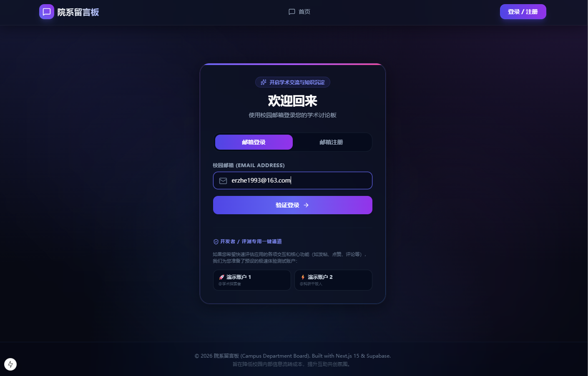
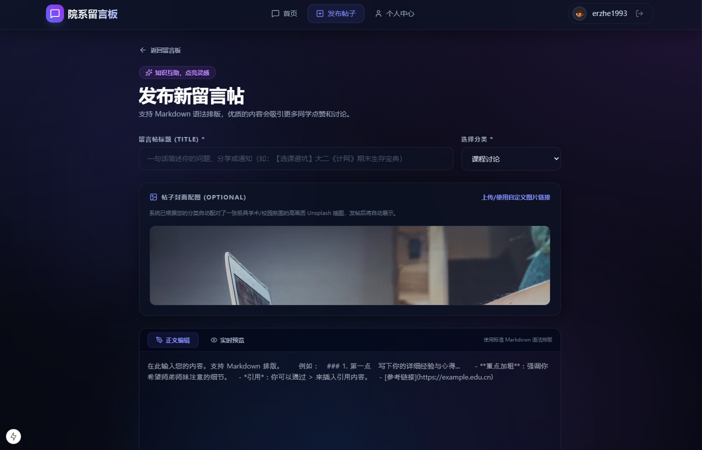

This is a [Next.js](https://nextjs.org) project bootstrapped with [`create-next-app`](https://nextjs.org/docs/app/api-reference/cli/create-next-app).

## Getting Started

First, run the development server:

```bash
npm run dev
# or
yarn dev
# or
pnpm dev
# or
bun dev
```

Open [http://localhost:3000](http://localhost:3000) with your browser to see the result.

You can start editing the page by modifying `app/page.tsx`. The page auto-updates as you edit the file.

This project uses [`next/font`](https://nextjs.org/docs/app/building-your-application/optimizing/fonts) to automatically optimize and load [Geist](https://vercel.com/font), a new font family for Vercel.

## Learn More

To learn more about Next.js, take a look at the following resources:

- [Next.js Documentation](https://nextjs.org/docs) - learn about Next.js features and API.
- [Learn Next.js](https://nextjs.org/learn) - an interactive Next.js tutorial.

You can check out [the Next.js GitHub repository](https://github.com/vercel/next.js) - your feedback and contributions are welcome!

## Deploy on Vercel

The easiest way to deploy your Next.js app is to use the [Vercel Platform](https://vercel.com/new?utm_medium=default-template&filter=next.js&utm_source=create-next-app&utm_campaign=create-next-app-readme) from the creators of Next.js.

Check out our [Next.js deployment documentation](https://nextjs.org/docs/app/building-your-application/deploying) for more details.


# 项目简介
Campus Department Board（院系留言板）是一个基于 Next.js + Supabase 构建的现代化校园社区平台。

- 发布院系相关帖子
- 浏览课程经验
- 分享学习资源
- 讨论考试内容
- 获取实习就业信息
- 收藏优质内容
- 与同院系同学交流互动

项目采用 Serverless 架构设计，支持快速开发与部署。

---

## 🏗️ 技术栈

### Frontend
- Next.js 15
- React
- TypeScript
- Tailwind CSS

### Backend
- Supabase Auth
- PostgreSQL
- Supabase Storage

### DevOps
- GitHub
- Vercel

---

## 🎯 产品目标

- 降低院系信息获取成本
- 建立知识沉淀社区
- 提高学生参与度
- 提升院系交流效率

---

## 🚀 MVP 功能

- 用户登录
- 浏览帖子
- 发布帖子
- 评论系统
- 搜索功能
- 收藏功能
- 点赞功能

---

## 📄 License

MIT License

---

## 🎓 项目愿景

让每一个院系都拥有属于自己的知识社区。

Build knowledge. Share experience. Grow together.

# 项目截图




